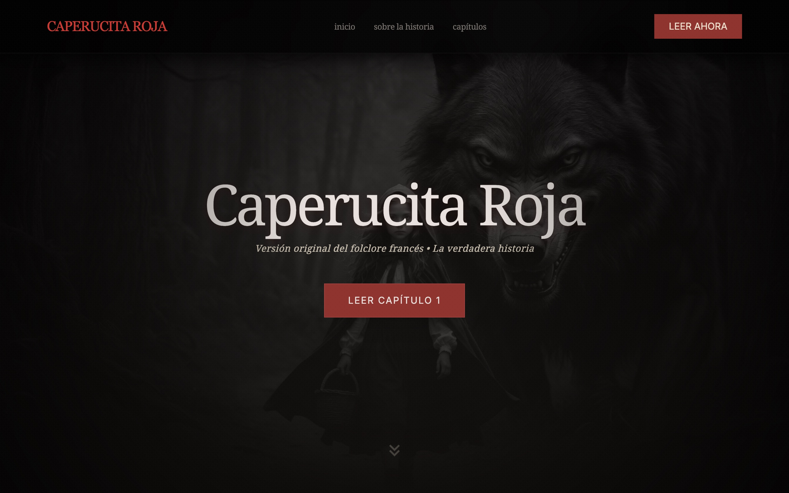
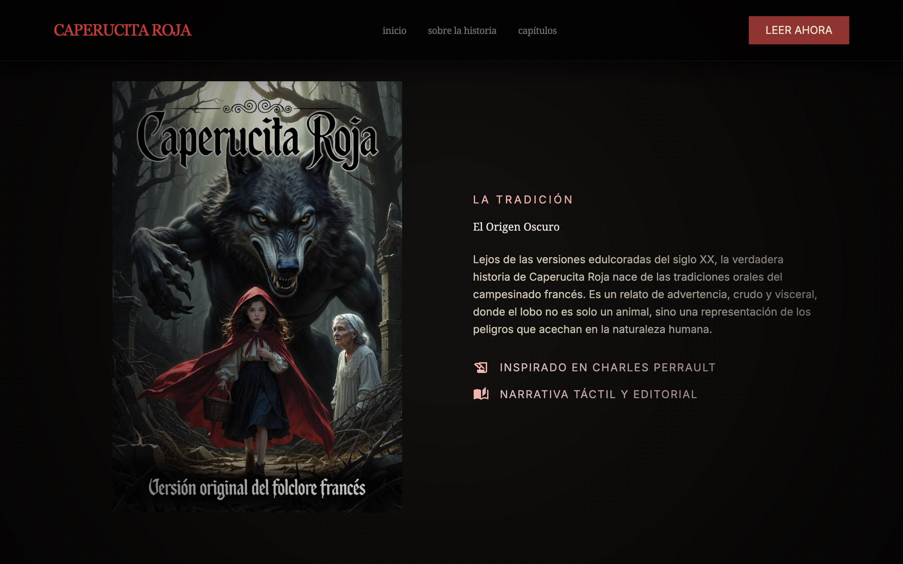
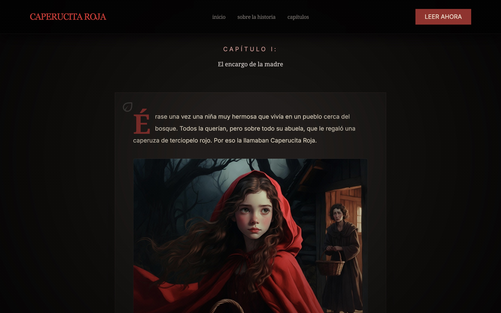
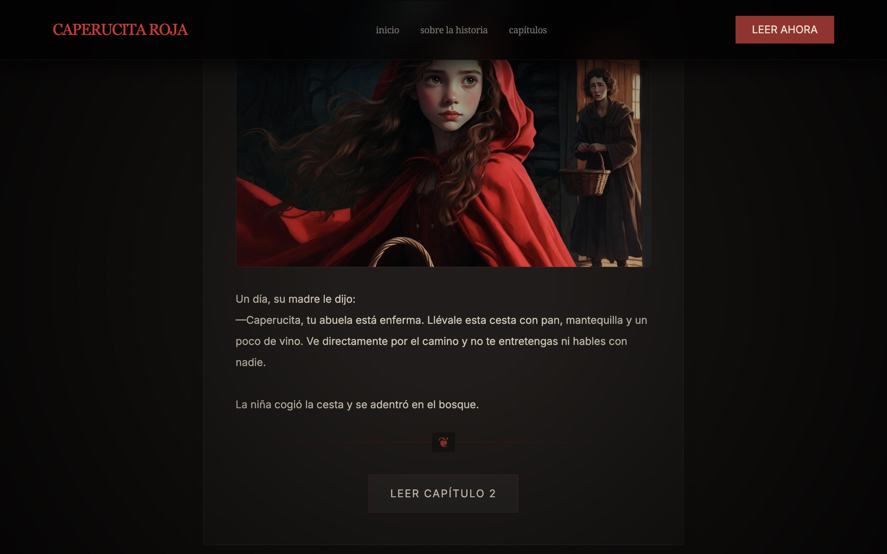

# README

<!-- ## Proyecto: **Historia de "Caperucita Roja (Versión original francesa del folclore)"** -->
## *Proyecto:*   **Historia de "Caperucita Roja"  **(Versión original francesa del folclore)

### Descripción:
Un proyecto de Factoria F5 Bootcamp para aprender cómo hacer commits, utilizar Git y más.  
Yo elijé la historia de Caperucita Roja, pero otra versión original francesa del folclore  
con un final muy aterrador (no para niños).  

### Enlace a sitio web:
[GitHub Pages](https://danielmuntyanu.github.io/ex-git-and-github-little-red-riding-hood/)

## Etapas:
1. ✅ Escribir un plan en [README.md].
2. ✅ Crear todo la historia con IA (mínimo 10 capitulos) y meter á un archivo de texto.
3. ✅ Crear el prototipo de sitio web con Google Stitch con solo capitulo uno.
4. ✅ Modificar los estilos de sitio web.
5. ✅ Crear los imagenes de capitulos y un banner con IA y meterlos a una carpeta. 
6. ✅ Añadir un banner y una imagen para el primer capítulo con estilo y ubicación correctos.
7. ✅ Añadir mas capitulos y imagenes al sitio web.
8. ✅ Actualizar el sitio web a GitHub Pages.
9. ✅ Modificar el archivo [README.md] con screenshot de sitio web funcional.  
10. Crear un Tag "v1.0" para hacer versión 1.0 de proyecto.

## Stack:
- Google Stitch (Prototipo)
- GROK LLM (Para escribir la historia)
- GROK Imagine (Para crear los imagenes)
- HTML5
- CSS3
- Tailwind CSS
- GIT
- GitHub Pages

## Screenshots

### 1. Navigation and Hero

### 2. About

### 3. Chapter 1

      

# Exercise - Git and GitHub - Little Red Riding Hood

## Descripción

El objetivo de este ejercicio es practicar **cuándo y por qué** se realizan los commits, aplicando buenas prácticas de control de versiones. Deberás contar una historia clásica mediante código, prestando especial atención al historial (Git Graph) de tu repositorio.

## Instrucciones

1. Crea un repositorio en GitHub llamado `ex-git-little-red-riding-hood` (o `ex-git-three-little-pigs` si prefieres esa historia. También puedes elegir otro cuento según tu preferencia).
2. **Planificación**: Utiliza Stitch (o herramienta similar) para prototipar tu historia. Antes de programar, analiza y planifica qué commits vas a realizar. Explica en el Readme tu analizis y tu planificación.
3. **Desarrollo**:
   - Cuenta la historia de Caperucita Roja mediante **HTML**. (División clara entre momento claves o capítulos)
   - Añade estilos y diseño con **CSS**.
   - Enriquece la historia con imágenes.
4. **Control de Versiones**: Realiza los commits pertinentes y súbelos al repositorio. **Importante**: El *cuándo* se hace el commit es clave.
5. **Despliegue**: Activa **GitHub Pages** para visualizar el resultado.

## Buenas Prácticas para Commits

Para superar este ejercicio con éxito, aplica estas reglas en tu flujo de trabajo:

- **Atomicidad**: Cada commit debe resolver una única tarea lógica (ej: "Crear estructura HTML básica", "Añadir estilos al header"). No mezcles cambios de diferentes contextos en un solo commit.
- **Mensajes Descriptivos**: El mensaje debe explicar *qué* hace el commit y el *por qué* de los cambios, en lugar del *cómo*. Usa imperativo (ej: `feat: add navigation bar` o `style: change background color`).
- **Frecuencia**: Haz commit a menudo. No esperes a terminar todo el proyecto. Si algo funciona, haz commit.
- **Convenciones**: Usar *Conventional Commits* (prefijos como `feat:`, `fix:`, `docs:`, `style:`) para mantener el historial ordenado. [Conventional Commits](https://www.conventionalcommits.org/en/v1.0.0/#summary)

## Requisitos Técnicos

- Uso de HTML5 y CSS3.
- Despliegue funcional en GitHub Pages.

## Entregables

- Enlace al repositorio de GitHub.
- Enlace a la página desplegada en GitHub Pages.
- Una captura de pantalla del resultado final (visible en el `README.md` del repositorio).

---

|   Nivel                            | Descripción del desempeño                                                                                      | Puntuación |
|------------------------------------|----------------------------------------------------------------------------------------------------------------|------------|
| Ejercicio no entregado | No se entrega repositorio, no hay código, o no existe ninguna contribución real en el historial de commits.                |	0 pts      |
| Ejercicio no cumple con un mínimo. | El repositorio existe pero no cumple los requisitos mínimos: historia incompleta, HTML o CSS insuficientes, commits escasos o mal estructurados, README pobre o inexistente, sin despliegue en GitHub Pages. | 40 pts |
| Ejercicio cumple con un mínimo pero falla en ciertos aspectos | La historia está contada en HTML, hay estilos CSS básicos, imágenes añadidas, commits realizados con cierta lógica, README funcional, y GitHub Pages activado. Sin embargo, faltan buenas prácticas claras, planificación insuficiente o commits poco atómicos. | 70 pts |
| Ejercicio  completo y con todos los requisitos implementados | Historia completa en HTML con capítulos claros, CSS trabajado, imágenes integradas, planificación explicada en el README, commits atómicos y bien descritos siguiendo Conventional Commits, historial limpio, despliegue en GitHub Pages funcional, y README bien redactado con captura final. | 100 pts |
